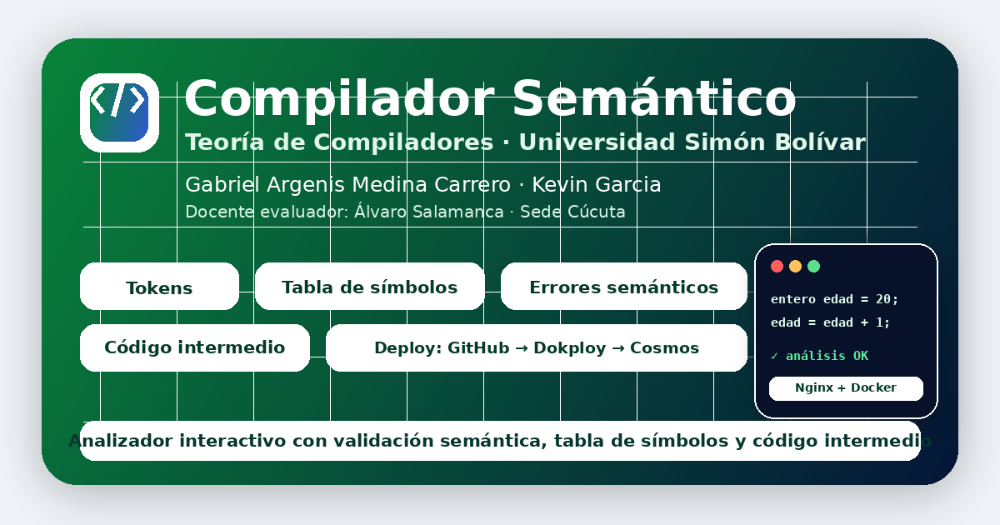

# Compilador Semántico



Aplicación web interactiva para comprender y probar la fase de **análisis semántico** dentro del proceso de compilación.  
El proyecto permite escribir código en un minilenguaje didáctico, analizarlo y visualizar sus **tokens**, **tabla de símbolos**, **errores sintácticos/semánticos**, **explicación paso a paso** y **código intermedio**.

---

## Información general

| Campo | Detalle |
|---|---|
| Proyecto | Compilador Semántico Web |
| Universidad | Universidad Simón Bolívar |
| Sede | Cúcuta |
| Programa | Ingeniería de Sistemas |
| Curso | Teoría de Compiladores |
| Docente evaluador | Álvaro Salamanca |
| Integrantes | Gabriel Argenis Medina Carrero · Kevin Garcia |
| Tipo de proyecto | Web interactiva / demo académica |
| Despliegue | GitHub → Webhook → Dokploy → Docker Compose → Nginx → Cosmos |

---

## Objetivo del proyecto

El objetivo principal es convertir un tema abstracto de compiladores en una experiencia visual y práctica.

En lugar de explicar únicamente la teoría, la aplicación permite que el usuario escriba instrucciones, ejecute el análisis y observe cómo el sistema interpreta el código. De esa manera se puede entender mejor qué hace un compilador cuando revisa si un programa está bien escrito y si sus instrucciones tienen sentido.

El enfoque principal está en el **análisis semántico**, pero también se muestran etapas relacionadas como el análisis léxico, sintáctico y la generación de una representación intermedia.

---

## Funcionalidades principales

- Interfaz web moderna, pública y responsiva.
- Sección inicial con explicación clara del proyecto.
- Flujo visual de las fases del compilador:
  - Código fuente
  - Análisis léxico
  - Análisis sintáctico
  - Análisis semántico
  - Código intermedio
- Editor interactivo de código.
- Botones con ejemplos precargados:
  - Ejemplo correcto
  - Ejemplo con errores
  - Condicional
- Análisis de tokens.
- Construcción de tabla de símbolos.
- Detección de errores de sintaxis.
- Detección de errores semánticos.
- Sugerencias para corregir errores.
- Generación de código intermedio didáctico.
- Sección **Acerca de** con información académica, integrantes, docente y despliegue.
- Favicon personalizado.
- Imagen de vista previa para compartir el enlace en WhatsApp y redes sociales.
- Logo institucional de la Universidad Simón Bolívar integrado como recurso visual.

---

## Minilenguaje usado

La aplicación no intenta compilar un lenguaje real como Java, C++ o Python.  
Usa un **minilenguaje didáctico** para que la explicación sea clara y fácil de seguir.

### Tipos de datos permitidos

```txt
entero
decimal
texto
logico
```

### Declaración de variables

```txt
entero edad = 20;
decimal promedio = 4.3;
texto nombre = "Gabriel";
logico aprobado = verdadero;
```

### Asignación de valores

```txt
edad = edad + 1;
promedio = 4.5;
nombre = "Kevin";
```

### Impresión

```txt
imprimir(nombre);
imprimir(edad);
```

### Condicionales

```txt
si (edad >= 18) {
  imprimir("Puede ingresar");
}
```

---

## Errores que puede detectar

### Errores de sintaxis

Son problemas relacionados con la forma en que está escrita la instrucción.

Ejemplos:

```txt
entero edad = 20
```

Error esperado: falta el punto y coma `;`.

```txt
decimal promedio 4.5;
```

Error esperado: falta el operador de asignación `=`.

```txt
imprimir(resultado;
```

Error esperado: falta cerrar el paréntesis `)`.

---

### Errores semánticos

Son problemas donde la instrucción puede parecer escrita correctamente, pero no tiene sentido según las reglas del lenguaje.

Ejemplos:

```txt
entero edad = 20;
texto nombre = "Gabriel";

edad = nombre;
```

Error esperado: no se puede asignar un valor de tipo `texto` a una variable de tipo `entero`.

```txt
eda = 30;
```

Error esperado: la variable `eda` no fue declarada. El analizador puede sugerir que quizá se quería escribir `edad`.

```txt
si (edad) {
  imprimir("Error");
}
```

Error esperado: la condición debe ser lógica, por ejemplo `edad >= 18`.

---

## Secciones de la página

### Inicio

Presenta el propósito general del proyecto y resume lo que hace el analizador.

### Fases

Explica el recorrido del compilador desde el código fuente hasta el código intermedio.  
Cada fase tiene una descripción breve para que el usuario no pierda el hilo del proceso.

### Demo

Es la parte principal del proyecto.  
Incluye el editor, los botones de ejemplo y los resultados del análisis.

### Documentación

Resume cómo usar el minilenguaje y cómo interpretar la salida.

### Acerca de

Incluye:

- Datos académicos.
- Integrantes.
- Docente evaluador.
- Universidad.
- Programa académico.
- Motivo del proyecto.
- Flujo de despliegue usado para publicarlo.

---

## Tecnologías utilizadas

| Tecnología | Uso |
|---|---|
| HTML5 | Estructura de la aplicación |
| CSS3 | Diseño visual, responsive y estilos institucionales |
| JavaScript | Motor del analizador léxico, sintáctico y semántico |
| Docker | Empaquetado del proyecto |
| Nginx | Servidor web estático dentro del contenedor |
| Docker Compose | Definición del servicio para despliegue |
| GitHub | Control de versiones y repositorio |
| Dokploy | Hosteador / plataforma de despliegue |
| Cosmos | Reverse proxy y salida por dominio |
| Cloudflare | DNS del dominio, según la configuración del entorno |

---

## Estructura del proyecto

```txt
.
├── index.html
├── styles.css
├── analyzer.js
├── Dockerfile
├── docker-compose.yml
├── README.md
├── CHANGELOG.md
├── LICENSE
├── site.webmanifest
├── favicon.svg
├── favicon.png
├── favicon.ico
├── apple-touch-icon.png
├── social-preview.png
├── social-preview.svg
├── assets/
│   ├── gabriel-medina.jpg
│   ├── kevin-garcia-animado.png
│   ├── alvaro-salamanca.png
│   ├── logo-unisimon-oficial.png
│   └── usb-academic-badge.png
└── docs/
    ├── 01-subir-a-github.md
    ├── 02-despliegue-dokploy-cosmos.md
    ├── 03-manual-de-uso.md
    ├── 04-explicacion-tecnica.md
    ├── 05-guion-presentacion.md
    ├── 06-preguntas-frecuentes.md
    ├── 07-pruebas-de-errores.md
    └── 08-acerca-y-despliegue.md
```

---

## Ejecución local

### Opción 1: abrir directamente

Puedes abrir el archivo `index.html` en el navegador.

Esta opción sirve para revisar rápidamente la interfaz, pero para probar el comportamiento real de despliegue es mejor usar Docker.

---

### Opción 2: ejecutar con Docker Compose

Desde la raíz del proyecto:

```bash
docker compose up -d --build
```

Luego abre:

```txt
http://localhost:8097
```

Para detenerlo:

```bash
docker compose down
```

Para reconstruir desde cero:

```bash
docker compose down --remove-orphans
docker compose build --no-cache
docker compose up -d
```

---

## Dockerfile

El proyecto se sirve con Nginx:

```dockerfile
FROM nginx:alpine
COPY . /usr/share/nginx/html
EXPOSE 80
```

Esto copia todos los archivos del proyecto dentro de la carpeta pública de Nginx.

---

## docker-compose.yml

```yaml
services:
  compilador-semantico:
    build: .
    container_name: compilador-semantico-web
    restart: unless-stopped
    ports:
      - "8097:80"
```

El contenedor expone internamente el puerto `80` de Nginx y lo publica en el puerto `8097` del servidor.

---

## Despliegue con GitHub, Dokploy y Cosmos

El flujo de despliegue pensado para este proyecto es:

```txt
GitHub
  ↓ webhook
Dokploy
  ↓ Docker Compose
Docker / Nginx
  ↓ puerto publicado
Cosmos
  ↓ reverse proxy
Dominio público
```

### Pasos generales

1. Subir el proyecto a GitHub.
2. Conectar el repositorio en Dokploy.
3. Crear un servicio tipo Docker Compose.
4. Usar `docker-compose.yml`.
5. Activar webhook para despliegue automático.
6. Publicar el puerto `8097`.
7. Crear una ruta en Cosmos hacia el servidor donde corre Dokploy.
8. Asociar el dominio o subdominio público.

Ejemplo de destino interno para Cosmos:

```txt
http://IP_DEL_SERVIDOR:8097
```

---

## Actualización del proyecto

Después de modificar archivos:

```bash
git add .
git commit -m "Describir cambios realizados"
git push
```

Si el webhook está activo, Dokploy debe reconstruir y publicar automáticamente la nueva versión.

---

## Solución de errores comunes

### La página se ve rota o sin estilos

Puede ser que el contenedor esté sirviendo una imagen anterior.

Solución local:

```bash
docker compose down
docker compose up -d --build
```

En Dokploy, se debe hacer un rebuild/redeploy o verificar que el webhook haya ejecutado el despliegue.

---

### El navegador no carga el CSS o JavaScript nuevo

El proyecto usa versionado en los archivos estáticos, por ejemplo:

```html
<link rel="stylesheet" href="styles.css?v=1.5.6" />
<script src="analyzer.js?v=1.5.6"></script>
```

Esto ayuda a que el navegador solicite la versión nueva de los archivos y evita que cargue versiones antiguas del CSS o del JavaScript.

---

### Aparecen símbolos raros al final de la página

Si aparecen textos como estos:

```txt
```

significa que quedó un conflicto de merge sin resolver.

Solución:

1. Abrir el archivo afectado.
2. Buscar `<<<<<<<`.
3. Eliminar las marcas de conflicto.
4. Dejar solo la versión correcta del código.
5. Guardar.
6. Hacer commit y push.

---

### WhatsApp no actualiza la vista previa

WhatsApp puede tardar en actualizar la miniatura del enlace.  
Para ayudar a refrescarla, el proyecto usa una imagen versionada:

```html
<meta property="og:image" content="https://dominio-del-proyecto.example/social-preview.png?v=6" />
```

Si se cambia la imagen, conviene aumentar el número de versión.

---

## Identidad visual institucional

El diseño usa como referencia el color institucional verde:

```txt
#09843B
```

También se incluye el logosímbolo oficial de la Universidad Simón Bolívar como archivo local:

```txt
assets/logo-unisimon-oficial.png
```

El logo se usa sin deformarlo, sin cambiarle color y manteniendo su proporción.  
La idea es respetar la identidad visual institucional y evitar manipular el logosímbolo de forma incorrecta.

---

## Captura previa para redes

El archivo principal para compartir el enlace es:

```txt
social-preview.png
```

Esta imagen fue diseñada para que al enviar el enlace por WhatsApp o redes sociales se muestre una vista previa enfocada en el proyecto, no en una fotografía personal.

Incluye:

- Nombre del proyecto.
- Universidad.
- Curso.
- Integrantes.
- Docente evaluador.
- Funciones principales del analizador.
- Referencia al despliegue con GitHub, Dokploy y Cosmos.

---

## Archivos importantes

| Archivo | Descripción |
|---|---|
| `index.html` | Página principal |
| `styles.css` | Estilos visuales y responsive |
| `analyzer.js` | Motor del analizador |
| `Dockerfile` | Imagen Docker basada en Nginx |
| `docker-compose.yml` | Servicio para despliegue |
| `social-preview.png` | Imagen de preview para WhatsApp/redes |
| `favicon.*` | Iconos del sitio |
| `assets/logo-unisimon-oficial.png` | Logo institucional |
| `docs/` | Documentación complementaria |

---

## Responsividad

El diseño incluye reglas responsive para que la página se adapte a diferentes tamaños de pantalla:

- Escritorio.
- Portátil.
- Tablet.
- Celular.

En pantallas pequeñas, las tarjetas se apilan, el editor ocupa el ancho disponible y los botones se reorganizan para mejorar la lectura.

---

## Integrantes

### Gabriel Argenis Medina Carrero

Creador del proyecto, implementación web, documentación, diseño de interfaz y despliegue.

### Kevin Garcia

Integrante del proyecto, apoyo académico, revisión del enfoque y acompañamiento del desarrollo.

---

## Docente evaluador

**Álvaro Salamanca**  
Curso: **Teoría de Compiladores**

---

---

## Nota importante sobre JavaScript

El archivo `analyzer.js` es el encargado de activar la lógica del proyecto:

- Botones de ejemplos.
- Botón **Analizar código**.
- Botón **Limpiar**.
- Cambio de pestañas.
- Detección de errores.
- Generación de tabla de símbolos.
- Generación de tokens.
- Generación de código intermedio.

Por eso, al final de `index.html` debe existir esta línea justo antes de `</body>`:

```html
<script src="analyzer.js?v=1.5.6"></script>
```

Si esa línea se elimina, la página carga visualmente, pero los botones dejan de funcionar.

---

## Versión limpia para entrega

Esta copia puede compartirse con el docente porque no incluye historial `.git`, credenciales, tokens, direcciones IP internas reales ni dominios personales de producción.

Para ejecutar localmente:

```bash
docker compose up -d --build
```

Luego abrir:

```txt
http://localhost:8097
```

Para revisar privacidad antes de enviar, ver:

```txt
PRIVACY_CHECKLIST.md
```

---

## Codigo comentado y manual tecnico

Esta version incluye comentarios de mantenimiento en los archivos principales:

| Archivo | Que se comento |
|---|---|
| `index.html` | Estructura de la pagina, secciones, demo, tabs, metadatos y conexion con JavaScript |
| `styles.css` | Variables, layout, tarjetas, demo, seccion Acerca de y responsive |
| `analyzer.js` | Tokenizacion, analisis, tabla de simbolos, errores, expresiones y renderizado |
| `Dockerfile` | Funcion de la imagen Nginx y copia de archivos |
| `docker-compose.yml` | Servicio, build, reinicio y puerto publicado |

Tambien se agrego el archivo:

```txt
docs/09-manual-tecnico-codigo.pdf
```

Este documento explica la arquitectura del proyecto, el flujo del analizador, la funcion de cada archivo y que partes se deben modificar si se quiere ampliar el compilador.

## Licencia

Este proyecto se desarrolló con fines académicos para la asignatura **Teoría de Compiladores**.

---

## Estado actual

Versión actual documentada:

```txt
v1.5.7
```

Incluye:

- Rediseño general de la interfaz.
- Sección Acerca de.
- Información académica.
- Fotos de integrantes/docente.
- Logo institucional.
- Favicon.
- Preview social.
- Corrección de conflictos de merge.
- Documentación completa para uso, despliegue y presentación.
